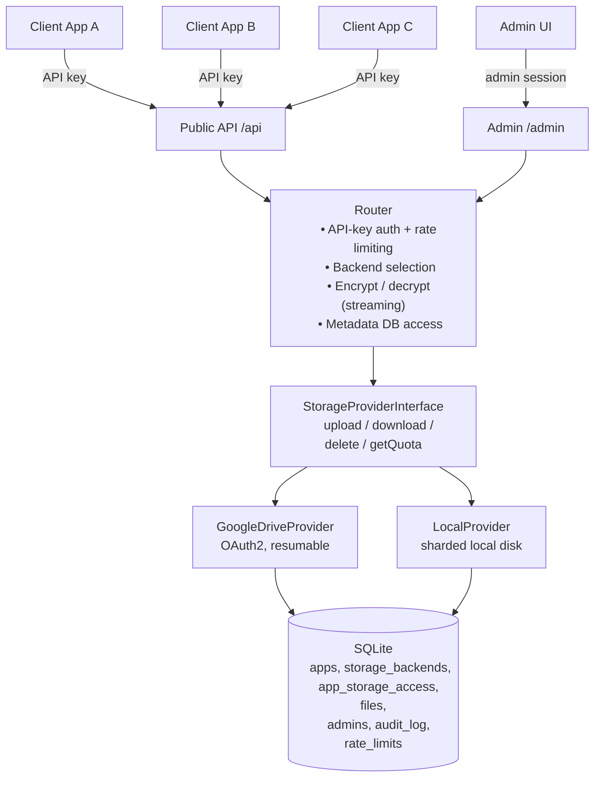

# 🗄️ Storage Router

[](LICENSE)
[](https://github.com/harisfi/storage-router/actions/workflows/ci.yml)
[](composer.json)

A multi-app, multi-provider **encrypted** storage router. A single PHP service lets any number of client applications upload, download, and delete files without ever knowing (or caring) where those files physically live. Content is encrypted before it touches any backend, and an admin controls which apps can use which storage pool.

**Every file is encrypted at rest** — on Google Drive or on local disk — using envelope encryption. Backends are pure blob stores; only the router holds the keys and the metadata.

> Works with **PHP ≥ 8.1**, SQLite, and nothing else. No framework, no JS build step, no external PHP dependencies.

## Features

- **REST API** (`/api/*`) for client apps — upload, download, delete — scoped per app and per optional `user_id`.
- **Envelope encryption** (`libsodium`): a random per-file DEK wrapped by a per-app KEK, streamed through `crypto_secretstream_xchacha20poly1305`.
- **Two storage backends** behind one interface: **Google Drive** (via REST OAuth2) and **local disk**, freely mixed per app.
- **Backend selection** — least-used-space first, priority as a manual tie-breaker, with retry-on-failure to the next candidate.
- **Admin UI** (`/admin/*`) — manage backends, apps, app↔backend assignments, a file browser, and an operational-error view.
- **Versioned KEK rotation** — re-wrap DEKs without touching file content, and without ever breaking in-flight decryption.
- **Per-app rate limiting**, a **per-IP login throttle** on the admin form, a **backup** tool (with passphrase encryption), and a **post-deploy security verification** tool.
- **Audit log** of admin actions, content-level access, and every operational failure.

## Architecture



**Key idea:** the router is the single source of truth for file location and metadata. Drive accounts and local paths are interchangeable, encrypted blob stores.

## Security model

Encryption is at the core, so it's worth being precise:

- Each file gets a random **Data Encryption Key (DEK)**.
- The file is encrypted with the DEK using a streaming AEAD construction (`crypto_secretstream_xchacha20poly1305`), which generates a fresh nonce per file and authenticates every chunk — tampering aborts the download rather than serving bad data.
- The DEK is wrapped under a per-app **Key Encryption Key (KEK)**, stored as a `0400` file under `storage/keys/` (outside version control and, ideally, outside the webroot).
- A compromise of one app's KEK never exposes another app's files.

Secrets and protection, summarized:

| What | Where | Protection |
|---|---|---|
| Per-app KEKs | `storage/keys/{app_id}.kek` | `0400`, gitignored, `.htaccess` deny-all |
| Wrapped DEKs | SQLite `files.encrypted_dek` | Only decryptable with the matching KEK |
| Google OAuth refresh tokens | SQLite `storage_backends.provider_config` | Encrypted at rest under a dedicated system KEK |
| Admin password / API keys | SQLite | `password_hash()` / SHA-256 hash (API keys shown once) |
| Ciphertext (blobs) | Drive or local backend | Opaque — backend can't read it |

**Two load-bearing rules from the threat model:**
1. **KEK/DB separation** — the KEK store and the SQLite DB must live in separate trust boundaries (separate backups, snapshots, permissions). If an attacker gets both together, everything is decryptable.
2. **Capacity is enforced transactionally** — local-backend capacity is checked inside the same DB transaction that inserts the file row, avoiding a check-then-write race.

> **Hosting note:** this project targets shared hosting where sensitive paths cannot sit structurally outside the webroot. They are protected with deny-all `.htaccess` rules. That is a real mitigation, not a structural guarantee — run `bin/verify-deployment.php` after every deploy (see [Deployment](#deployment)).

## Operations: filesystem permissions & the secrets contract

These rules matter — they're what stop a leaked file from becoming a full compromise:

- **Never commit**: `.env`, `storage/db/*.sqlite`, `storage/keys/*.kek`, `storage/local-backends/*` (all already gitignored). `.env.example` is the only config that belongs in version control.
- **`storage/keys/`** must be `0700` with each `.kek` file `0400` (created so by `KeyManager`, but confirm on a real deploy).
- **`storage/`** (and `db/`, `local-backends/`) should be `0700`, not world-readable.
- **Keep the KEK store and the SQLite DB in separate backups** — together they can decrypt everything; separately, neither is enough. If you use `bin/backup.php`, prefer `--encrypt` so the combined archive is itself secret; never archive the whole `storage/` directory wholesale.
- **Point the document root at `public/`** if your host allows it, so `storage/`, `src/`, and `vendor/` sit outside the webroot rather than relying only on `.htaccess` rules. `.htaccess` is **Apache-only** (ignored by Nginx and when `AllowOverride` is off) — see [Deployment](#deployment) for the Nginx equivalent, and run `bin/verify-deployment.php` after every deploy.

## Requirements

- PHP **≥ 8.1** with extensions: `pdo`, `pdo_sqlite`, `sodium`, `curl`, `json`.
- [Composer](https://getcomposer.org/) (used only for PSR-4 autoloading — no packages are required).
- Apache with `AllowOverride All` enabled, or any web server that routes to `public/`.

## Installation

```bash
composer install

cp .env.example .env   # then edit .env (see Configuration)
php bin/migrate.php    # creates the SQLite schema; idempotent — safe to re-run

# create your first admin for the /admin UI
php bin/create-admin.php yourusername
```

Serve the `public/` directory as your document root (the API front controller is `public/api/index.php`, the admin UI is `public/admin/index.php`). Point both at it, or use the shared-hosting rewrite in [Deployment](#deployment).

## Quickstart

After install, the full round trip is:

```bash
# 1. Create an app — prints an API key exactly once; only its hash is stored.
php bin/create-app.php "My App"

# 2. Create a local backend (cap in bytes; 0 = uncapped)
php bin/create-local-backend.php "Local #1" 5368709120 <app_id>

# 3. Assign the backend to the app
php bin/assign-backend.php <app_id> <storage_id> 100

# 4. Use the API
curl -X POST -H "X-API-Key: <your_key>" --data-binary @somefile.txt https://yourdomain.com/api/upload
curl -H "X-API-Key: <your_key>" https://yourdomain.com/api/files/<file_id> -o downloaded.txt
curl -X DELETE -H "X-API-Key: <your_key>" https://yourdomain.com/api/files/<file_id>
```

Optional: add `-H "X-User-Id: some-user"` to scope a file to a specific app-defined user.

## Configuration

Copy `.env.example` to `.env` and set:

| Key | Default | Description |
|---|---|---|
| `APP_ENV` | `production` | Environment label. |
| `DB_PATH` | `storage/db/router.sqlite` | SQLite database path. |
| `KEK_STORE_PATH` | `storage/keys` | Directory for per-app KEK files (`0400`, never committed). |
| `GOOGLE_OAUTH_CLIENT_ID` | — | Google OAuth2 client ID (required for Drive backends). |
| `GOOGLE_OAUTH_CLIENT_SECRET` | — | Google OAuth2 client secret. |
| `GOOGLE_OAUTH_REDIRECT_URI` | — | Redirect URI registered in Google Cloud Console. |
| `ADMIN_SESSION_SECRET` | — | Secret for admin sessions. |
| `RATE_LIMIT_UPLOAD_PER_MINUTE` | `30` | Uploads per app per 60s window; `0` disables. |
| `RATE_LIMIT_FILES_PER_MINUTE` | `120` | File download/delete requests per app per 60s; `0` disables. |
| `MAX_UPLOAD_BYTES` | `0` | Max plaintext upload size in bytes (`0` = unlimited). Enforced from the `Content-Length` header *before* encryption and from the actual encrypted size after, so a missing header can't bypass it. |
| `GOOGLE_OAUTH_TOKEN_URL` | real Google | Testing override only — point at a fake server. |
| `GOOGLE_USERINFO_URL` | real Google | Testing override only. |
| `GOOGLE_AUTHORIZE_URL` | real Google | Testing override only. |
| `GOOGLE_DRIVE_API_BASE_URL` | real Google | Testing override only. |
| `GOOGLE_DRIVE_UPLOAD_BASE_URL` | real Google | Testing override only. |

`.env` must **never** be committed or reachable by URL.

## API reference

All endpoints are authenticated with an `X-API-Key` header (or `Authorization: Bearer <key>`) and scoped to the calling app.

| Method | Path | Description | Success |
|---|---|---|---|
| `POST` | `/api/upload` | Stream a file body; encrypt, select a backend, store. | `201` → `{ "file_id": "..." }` |
| `GET` | `/api/files/{file_id}` | Stream the decrypted file back, `Content-Disposition: attachment`. | `200` |
| `DELETE` | `/api/files/{file_id}` | Delete from backend + metadata. | `204` |

Optional request header: `X-User-Id` (opaque, app-defined) to scope files to a specific end-user.

Error responses use a small fixed catalog with HTTP status codes:

| Status | Code | Meaning |
|---|---|---|
| `401` | `unauthorized` | Missing/invalid API key, or app suspended. |
| `404` | `not_found` | File not found **or not owned by this app** (IDOR protection). |
| `405` | `invalid_request` | Method not allowed. |
| `413` | `invalid_request` | Upload exceeds `MAX_UPLOAD_BYTES` (checked before encryption and again after). |
| `429` | `rate_limited` | Per-app rate limit exceeded (also sends `Retry-After: 60`). |
| `507` | `no_storage_available` | No eligible backend could accept the file. |
| `400`/`500` | `invalid_request` / `internal_error` | Malformed request / unexpected failure. |

**Download:** streams decrypted bytes to the caller with per-chunk AEAD authentication and the exact `Content-Length` sent up front — a mid-stream failure aborts the transfer, which the client detects as truncation (fewer bytes than advertised) rather than receiving a silent short-but-valid file. **Upload size:** the cap is enforced by **counting actual bytes read** from the request body, so a spoofed `Content-Length` can't bypass it. **Delete:** the stored DEK is destroyed before the backend blob is removed, so even if the blob delete fails, the leftover ciphertext is permanently undecryptable. Memory stays bounded (everything streams through `php://temp` with a 5 MiB in-RAM cap, spilling to a temp file for large files).

## Admin UI

Sign in at `/admin/login`. From the dashboard you can:

- **Storage Backends** — add a local backend or connect a Google Drive account via OAuth, enable/disable, remove (only when it holds no files).
- **Apps** — create apps (API key shown once), suspend/activate.
- **Assignments** — choose which backends each app may use and their priority.
- **Files** — browse and migrate files across backends; view metadata.
- **Errors** — review `audit_log` failure rows.

## CLI reference

| Command | Purpose |
|---|---|
| `php bin/migrate.php` | Run pending SQL migrations (idempotent). |
| `php bin/create-admin.php <username>` | Create an admin account (prompts for password, min 12 chars). |
| `php bin/create-app.php "Name"` | Create an app; prints the API key once. |
| `php bin/create-local-backend.php "Label" <cap_bytes> [app_id]` | Create a local disk backend. |
| `php bin/list-storage-backends.php` | List all backends. |
| `php bin/assign-backend.php <app_id> <storage_id> [priority]` | Grant an app access to a backend. |
| `php bin/refresh-quota.php [storage_id]` | Refresh cached quota (omit to refresh all). |
| `php bin/rotate-kek.php <app_id>` | Rotate an app's KEK: re-wrap all active DEKs to a new version. |
| `php bin/delete-kek.php <app_id> <version>` | Purge an obsolete historical KEK version (refuses if any file of any status still references it). |
| `php bin/prune-keys.php` | Scheduled: destroy every obsolete KEK version across all apps (same gate as delete-kek; exit≠0 on failure for alerting). |
| `php bin/backup.php [output_dir] [--encrypt]` | Snapshot DB + only the KEKs the live DB needs (never interleaves with rotation/purge). `--encrypt` writes a single passphrase-encrypted `.backup.enc`. |
| `php bin/restore-backup.php <backup.enc> <dir>` | Decrypt a `--encrypt` backup and restore DB + KEKs. |
| `php bin/verify-deployment.php <base_url>` | Post-deploy security check over HTTP (see below). |
| `php bin/verify-deployment.php --repo [dir]` | Static/structural checks (guards, gitignore, no tracked secrets, docroot split) — runs in CI. |

## Deployment

**Simplest option** — point your document root directly at `public/`. Then the deny-all `.htaccess` rules inside `storage-router/` are purely defensive and the sensitive paths sit outside the docroot entirely.

**Shared hosting** — if the whole repo must live under your webroot (e.g. as `public_html/storage-router/`), add a root `.htaccess` that routes every request into the app's `public/` folder:

```apache
RewriteEngine On
RewriteCond %{REQUEST_URI} !^/storage-router/public/
RewriteRule ^(.*)$ /storage-router/public/$1 [L]
```

Then:

1. `composer install --no-dev --optimize-autoloader` on the host.
2. Copy `.env.example` → `.env` and set real values (never commit `.env`).
3. Confirm `AllowOverride All` is enabled so the deny-all `.htaccess` rules take effect.
4. Run `php bin/migrate.php`.
5. **Verify the security-critical paths return `403`** — see below.

> **Important:** `.htaccess` rules are only honored by Apache with `AllowOverride All`. They do **nothing** on **Nginx**, whose equivalent is explicit `location` blocks. If you use Nginx, or you cannot enable overrides, the structural fix is to point the document root at `public/` so `storage/`, `.env`, `src/` and `vendor/` are never web-reachable.

**Nginx** — point `root` at `public/` and add explicit denies as defense-in-depth:

```nginx
location / {
    try_files $uri /index.php?$query_string;
}

# Never serve these, even though they sit outside the docroot.
location ~ ^/(\.env|storage|src|vendor)(/|$) {
    deny all;
}
location ~ /\.(?!well-known).* {
    deny all;   # hidden files (.env, .git, …) are never served
}
```

### Post-deploy verification

Every sensitive path is protected by deny-all rules. The most important to confirm after any deploy:

- `storage-router/.env` (holds OAuth secret + session secret)
- `storage-router/storage/db/router.sqlite` (admin hashes, app API keys, wrapped DEKs)
- `storage-router/storage/keys/` (per-app encryption keys — a leak here + DB access defeats all encryption)
- `storage-router/storage/local-backends/` (ciphertext blobs)
- `storage-router/composer.json`, `storage-router/src/...`, `storage-router/vendor/autoload.php`

Automate this check after every deploy:

```bash
php bin/verify-deployment.php https://yourdomain.com
```

To keep the *structural* invariants from depending on human discipline, the same tool runs a static `--repo` check in CI on every push (GitHub Actions: "Deployment structure checks"), failing the build if deny-rule files are missing, secrets are tracked or not gitignored, or a sensitive directory ever lands inside `public/`:

```bash
php bin/verify-deployment.php --repo .   # repo root containing router-app/
```

It makes real HTTP requests, asserts each sensitive path is blocked and the public pipeline works, and exits non-zero on any failure (usable as a CI/deploy check).

## Project layout

```
storage-router/
├── .env.example          # config template (never commit .env)
├── bin/                  # CLI tools (migrate, create-app, backup, ...)
├── public/
│   ├── api/index.php     # /api/* front controller
│   └── admin/index.php   # /admin/* front controller
├── src/
│   ├── Api/              # public API router, controllers, middleware
│   ├── Admin/            # admin router, controllers, views
│   ├── Storage/          # provider interface + Google Drive & local providers, selector
│   ├── Crypto/           # EnvelopeEncryptor, KeyManager (KEKs)
│   ├── Data/             # PDO connection, repositories, SQL migrations
│   └── Support/          # Config, Session, CSRF, ErrorCatalog, UuidGenerator
├── storage/              # runtime state: db/, keys/, local-backends/, backups/
├── tests/                # test suite
├── composer.json
└── LICENSE
```

## Backup

`bin/backup.php` produces a consistent snapshot: the SQLite DB via `VACUUM INTO` (safe on a live database) **plus** only the KEKs the live database actually needs — each app's current KEK version and any version still referenced by an active file. Obsolete historical keys with zero active references are deliberately excluded, so an old backup can't widen the blast radius by carrying keys for data that is no longer reachable.

Use `--encrypt` to collapse DB + the needed KEKs into a single passphrase-encrypted artifact whose plaintext intermediates are deleted:

```bash
# encrypt (passphrase from BACKUP_PASSWORD env or an interactive prompt)
BACKUP_PASSWORD='...' php bin/backup.php --encrypt

# restore
php bin/restore-backup.php <backup.enc> <restore_dir>
```

**Treat an unencrypted archive as a secret.** An archive bucket or `storage/` copy that holds the DB *and* the KEKs is the complete master secret — keep it off the server, keep the passphrase separate from the artifacts, and never archive the whole `storage/` directory wholesale into the same location.

## KEK retention

Rotating an app's KEK (`bin/rotate-kek.php`) re-wraps every active DEK under a new version; the old key becomes obsolete once nothing references it. Historical versions are removed with a **strict, gated purge**:

```bash
# manual, explicit
php bin/delete-kek.php <app_id> <version>

# automated (scheduled), destroys every obsolete version across all apps
php bin/prune-keys.php
```

Both use the **same gate**: a KEK is destroyed only if it is (a) **below** the app's current version (the live key is never removed) and (b) referenced by **no file of any status** — including soft-deleted files, matching permanent-deletion semantics. Deleting a key while any file still references it would make that file permanently undecryptable, so the gate refuses.

**Do not rely on operator memory** — run prune-keys on a schedule:

```cron
0 2 * * *  /usr/bin/php /path/to/router-app/bin/prune-keys.php  >> /var/log/storage-router-prune.log 2>&1
```

`prune-keys.php` exits non-zero if **any** deletion fails, so a monitoring/alerting wrapper around `$?` or the exit code catches problems immediately.

## Operation atomicity & locking

`backup`, `rotate-kek`, `delete-kek`, and `prune-keys` all take a shared exclusive lock (`storage/ops.lock`) and run **mutually exclusive**:

- **Rotation is transactional.** All per-file DEK re-wraps and the app's version bump commit in one SQLite transaction; any failure rolls back completely, so the app is never left half on the old version and half on the new, and the operation can simply be re-run.
- **Backup cannot race rotation/purge.** Because they serialize on the same lock, a backup's DB snapshot and its KEK copy always describe the same state — it never captures "new KEK but not all re-wrapped DEKs" or an old key mid-deletion.
- A concurrent run fails fast with "another storage operation is in progress" instead of corrupting the pairing.

## Testing

The test suite runs on PHPUnit against an in-memory SQLite, so it never touches real `storage/` data:

```bash
composer install        # installs dev dependencies (phpunit)
vendor/bin/phpunit
```

Coverage is focused on the highest-stakes code: `Crypto/` (encryption), `Storage/` (selection), the rate limiter, migrations, and repository app-isolation (IDOR) behavior. CI runs the suite on PHP 8.1–8.3. See [CONTRIBUTING](CONTRIBUTING.md) for how to add tests.

## Roadmap / known limits

- **API surface** — currently upload / download / delete. Listing, overwrite (`PUT`), and metadata endpoints are not implemented.
- **Quota refresh** — manual only; no scheduled/cron refresh.
- **KEK deletion** — gated and scriptable (`delete-kek.php` manual, `prune-keys.php` scheduled); always refuses to touch a live or still-referenced version, never session-triggered.
- **Providers** — Google Drive and local disk only. S3/others can be added behind `StorageProviderInterface`.

## License

[MIT](LICENSE) © Storage Router
